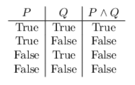
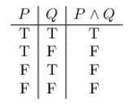
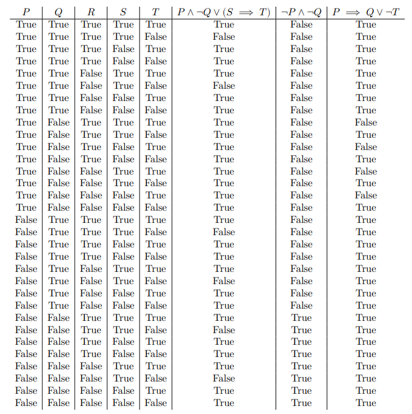

# truth-table-generator
Truth table generator written in Python. Uses Shunting-Yard algorithm to parse logical expressions with `AND`, `OR`, `NOT`, and `IMPLIES` operators, and parentheses.

## Usage

Arguments: `latex`, `short`. 
 - `latex`: specifies whether or not to print as LaTeX source
 - `short`: specifies whether or not to, when printing LaTeX source, use T/F instead of True/False

## Examples

### Example: no arguments

```
$ python table_generator.py
Enter variable names separated by spaces: P Q
Enter a logical expression of your variables: P AND Q
Enter another expression or hit <Return> to proceed:
        P       Q       P AND Q
        True    True    True
        True    False   False
        False   True    False
        False   False   False
```

### Example: `latex` argument

```
$ python table_generator.py latex
Enter variable names separated by spaces: P Q
Enter a logical expression of your variables: P AND Q
Enter another expression or hit <Return> to proceed:
\begin{array}{c|c|c}
 P & Q & P \land Q\\
 \hline
 \text{True} & \text{True} & \text{True}\\
 \text{True} & \text{False} & \text{False}\\
 \text{False} & \text{True} & \text{False}\\
 \text{False} & \text{False} & \text{False}\\
\end{array}
```

LaTeX render:



### Example: `latex` and `short` arguments:

```
$ python table_generator.py latex short
Enter variable names separated by spaces: P Q
Enter a logical expression of your variables: P AND Q
Enter another expression or hit <Return> to proceed:
\begin{array}{c|c|c}
 P & Q & P \land Q\\
 \hline
 \text{T} & \text{T} & \text{T}\\
 \text{T} & \text{F} & \text{F}\\
 \text{F} & \text{T} & \text{F}\\
 \text{F} & \text{F} & \text{F}\\
\end{array}
```

LaTeX render:



### More complex example

```
$ python table_generator.py latex
Enter variable names separated by spaces: P Q R S T
Enter a logical expression of your variables: P AND NOT Q OR ( S IMPLIES T )
Enter another expression or hit <Return> to proceed: NOT P AND NOT Q
Enter another expression or hit <Return> to proceed: P IMPLIES Q OR NOT T
Enter another expression or hit <Return> to proceed:
\begin{array}{c|c|c|c|c|c|c|c}
 P & Q & R & S & T & P \land \neg Q \lor ( S \implies T ) & \neg P \land \neg Q & P \implies Q \lor \neg T\\
 \hline
 \text{True} & \text{True} & \text{True} & \text{True} & \text{True} & \text{True} & \text{False} & \text{True}\\
 \text{True} & \text{True} & \text{True} & \text{True} & \text{False} & \text{False} & \text{False} & \text{True}\\
 \text{True} & \text{True} & \text{True} & \text{False} & \text{True} & \text{True} & \text{False} & \text{True}\\
 \text{True} & \text{True} & \text{True} & \text{False} & \text{False} & \text{True} & \text{False} & \text{True}\\
 \text{True} & \text{True} & \text{False} & \text{True} & \text{True} & \text{True} & \text{False} & \text{True}\\
 \text{True} & \text{True} & \text{False} & \text{True} & \text{False} & \text{False} & \text{False} & \text{True}\\
 \text{True} & \text{True} & \text{False} & \text{False} & \text{True} & \text{True} & \text{False} & \text{True}\\
 \text{True} & \text{True} & \text{False} & \text{False} & \text{False} & \text{True} & \text{False} & \text{True}\\
 \text{True} & \text{False} & \text{True} & \text{True} & \text{True} & \text{True} & \text{False} & \text{False}\\
 \text{True} & \text{False} & \text{True} & \text{True} & \text{False} & \text{True} & \text{False} & \text{True}\\
 \text{True} & \text{False} & \text{True} & \text{False} & \text{True} & \text{True} & \text{False} & \text{False}\\
 \text{True} & \text{False} & \text{True} & \text{False} & \text{False} & \text{True} & \text{False} & \text{True}\\
 \text{True} & \text{False} & \text{False} & \text{True} & \text{True} & \text{True} & \text{False} & \text{False}\\
 \text{True} & \text{False} & \text{False} & \text{True} & \text{False} & \text{True} & \text{False} & \text{True}\\
 \text{True} & \text{False} & \text{False} & \text{False} & \text{True} & \text{True} & \text{False} & \text{False}\\
 \text{True} & \text{False} & \text{False} & \text{False} & \text{False} & \text{True} & \text{False} & \text{True}\\
 \text{False} & \text{True} & \text{True} & \text{True} & \text{True} & \text{True} & \text{False} & \text{True}\\
 \text{False} & \text{True} & \text{True} & \text{True} & \text{False} & \text{False} & \text{False} & \text{True}\\
 \text{False} & \text{True} & \text{True} & \text{False} & \text{True} & \text{True} & \text{False} & \text{True}\\
 \text{False} & \text{True} & \text{True} & \text{False} & \text{False} & \text{True} & \text{False} & \text{True}\\
 \text{False} & \text{True} & \text{False} & \text{True} & \text{True} & \text{True} & \text{False} & \text{True}\\
 \text{False} & \text{True} & \text{False} & \text{True} & \text{False} & \text{False} & \text{False} & \text{True}\\
 \text{False} & \text{True} & \text{False} & \text{False} & \text{True} & \text{True} & \text{False} & \text{True}\\
 \text{False} & \text{True} & \text{False} & \text{False} & \text{False} & \text{True} & \text{False} & \text{True}\\
 \text{False} & \text{False} & \text{True} & \text{True} & \text{True} & \text{True} & \text{True} & \text{True}\\
 \text{False} & \text{False} & \text{True} & \text{True} & \text{False} & \text{False} & \text{True} & \text{True}\\
 \text{False} & \text{False} & \text{True} & \text{False} & \text{True} & \text{True} & \text{True} & \text{True}\\
 \text{False} & \text{False} & \text{True} & \text{False} & \text{False} & \text{True} & \text{True} & \text{True}\\
 \text{False} & \text{False} & \text{False} & \text{True} & \text{True} & \text{True} & \text{True} & \text{True}\\
 \text{False} & \text{False} & \text{False} & \text{True} & \text{False} & \text{False} & \text{True} & \text{True}\\
 \text{False} & \text{False} & \text{False} & \text{False} & \text{True} & \text{True} & \text{True} & \text{True}\\
 \text{False} & \text{False} & \text{False} & \text{False} & \text{False} & \text{True} & \text{True} & \text{True}\\
\end{array}
```

LaTeX render:



## Troubleshooting

Make sure you add the two dollar signs (`$$`) or otherwise specify that the array environment is contained in an equation in order to render it correctly.
