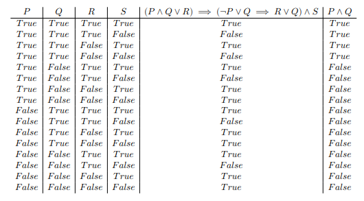

# truth-table-generator
Truth table generator written in Python. Uses Shunting-Yard algorithm to parse logical expressions with `AND`, `OR`, `NOT`, and `IMPLIES` operators, and parentheses.

Run in terminal with `python table_generator.py`:

```
$ python table_generator.py
Enter variable names separated by spaces: P Q R S
Enter a logical expression of your variables: ( P AND Q OR R ) IMPLIES ( NOT P OR Q IMPLIES R OR Q ) AND S
Enter another expression or hit <Return> to proceed: P AND Q
Enter another expression or hit <Return> to proceed: 
\begin{array}{c|c|c|c|c|c}
 P & Q & R & S & ( P \land Q \lor R ) \implies ( \neg P \lor Q \implies R \lor Q ) \land S & P \land Q\\
 \hline
 True & True & True & True & True & True\\
 True & True & True & False & False & True\\
 True & True & False & True & True & True\\
 True & True & False & False & False & True\\
 True & False & True & True & True & False\\
 True & False & True & False & False & False\\
 True & False & False & True & True & False\\
 True & False & False & False & True & False\\
 False & True & True & True & True & False\\
 False & True & True & False & False & False\\
 False & True & False & True & True & False\\
 False & True & False & False & True & False\\
 False & False & True & True & True & False\\
 False & False & True & False & False & False\\
 False & False & False & True & True & False\\
 False & False & False & False & True & False\\
\end{array}
```

This renders, from LaTeX source, the following:


